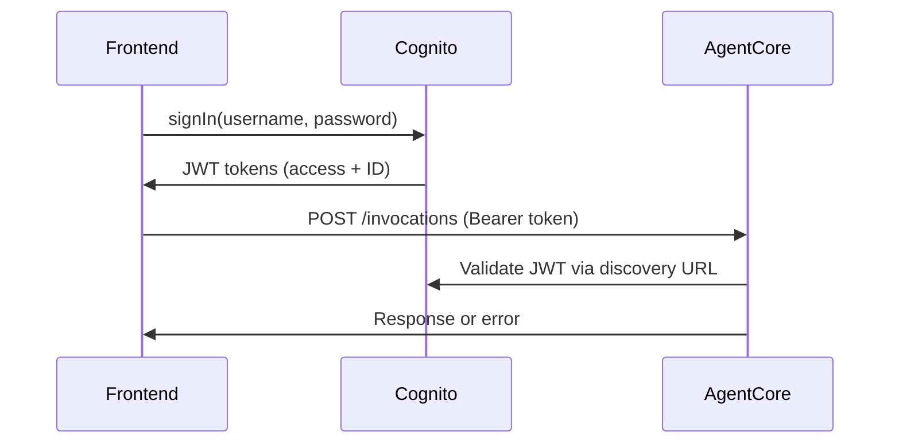
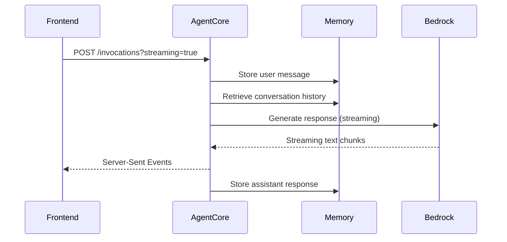

# ACME Corp AgentCore Chatbot - Architecture Documentation

## Overview

This document provides a comprehensive overview of the ACME Corp Bedrock AgentCore chatbot application, detailing the frontend architecture, backend integration patterns, and AWS service usage.

## System Architecture

```
┌─────────────────┐     ┌──────────────────┐     ┌────────────────────┐
│   React Web    │────▶│   AWS Cognito    │────▶│  AgentCore Runtime │
│   Frontend      │     │  Authentication  │     │   (Backend Agent)  │
│  (TypeScript)   │     │  (JWT Tokens)    │     │   Python + Strands │
└─────────────────┘     └──────────────────┘     └────────────────────┘
         │                        │                         │
         │                        │                         ▼
         ▼                        ▼               ┌─────────────────────┐
┌─────────────────┐     ┌──────────────────┐     │    AWS Services     │
│   CloudFront    │     │      S3 +        │     │ • Bedrock (Claude)  │
│   Distribution  │     │   Static Web     │     │ • AgentCore Memory  │
│   (Frontend)    │     │    Hosting       │     │ • Secrets Manager   │
└─────────────────┘     └──────────────────┘     │ • Code Interpreter  │
                                                 │ • MCP Integrations  │
                                                 └─────────────────────┘
```

## Frontend Architecture

### Technology Stack

The frontend is built using modern React with TypeScript:

- **Framework**: React 19.1.1 with TypeScript 4.9.5
- **Build Tool**: Create React App (react-scripts 5.0.1)
- **HTTP Client**: Axios 1.11.0 for API communication
- **Authentication**: amazon-cognito-identity-js 6.3.15
- **Styling**: Custom CSS with Aurora theme
- **Testing**: Jest + React Testing Library

### Project Structure

```
frontend/acme-chat/
├── public/                     # Static assets
│   ├── index.html             # Main HTML template
│   ├── favicon.ico            # App icon
│   └── aurora-bg.jpg          # Background image
├── src/
│   ├── components/            # React components
│   │   ├── ChatInterface.tsx  # Main chat UI
│   │   ├── Header.tsx         # App header
│   │   └── LoginForm.tsx      # Authentication form
│   ├── services/             # Business logic
│   │   ├── AgentCoreService.ts # Backend API communication
│   │   └── AuthService.ts     # Cognito authentication
│   ├── config.ts             # Configuration settings
│   ├── App.tsx               # Main application component
│   ├── App.css               # Application styles
│   └── index.tsx             # Application entry point
├── package.json              # Dependencies and scripts
└── tsconfig.json            # TypeScript configuration
```

### Core Components

#### 1. App Component (`src/App.tsx`)
- **Purpose**: Root application component managing authentication state
- **Key Features**:
  - User authentication state management
  - Dynamic body class management for aurora background
  - Error handling and loading states
  - Route switching between login and chat interfaces

#### 2. ChatInterface Component (`src/components/ChatInterface.tsx`)
- **Purpose**: Main chat interface with real-time messaging
- **Key Features**:
  - **Message Management**: Handles user and assistant messages with timestamps
  - **Streaming Support**: Real-time streaming responses from AgentCore
  - **Image Rendering**: Detects and displays S3/CloudFront image URLs
  - **Session Management**: Maintains conversation sessions with unique IDs
  - **Connection Testing**: Tests AgentCore connectivity on mount
  - **Error Handling**: Comprehensive error display and recovery

#### 3. LoginForm Component (`src/components/LoginForm.tsx`)
- **Purpose**: Cognito authentication interface
- **Features**:
  - Username/password authentication
  - Demo credentials pre-population
  - Loading states and error handling

#### 4. Header Component (`src/components/Header.tsx`)
- **Purpose**: Application header with user info and logout
- **Features**:
  - User email display
  - Logout functionality
  - Responsive design

### Service Layer

#### 1. AgentCoreService (`src/services/AgentCoreService.ts`)

The core service responsible for backend communication with AWS Bedrock AgentCore.

**Key Methods:**

```typescript
// Send regular message to AgentCore
sendMessage(prompt: string, accessToken: string): Promise<AgentResponse>

// Send streaming message with real-time callbacks
sendStreamingMessage(prompt: string, accessToken: string, callbacks: StreamingCallback): Promise<void>

// Test connectivity to AgentCore
testConnection(accessToken: string): Promise<{success: boolean; message: string}>
```

**API Integration Pattern:**

```typescript
// URL Construction
const escapedAgentArn = encodeURIComponent(config.agentcore.agentArn);
const url = `${config.agentcore.endpoint}/runtimes/${escapedAgentArn}/invocations?qualifier=DEFAULT`;

// Authentication Headers
const headers = {
  'Authorization': `Bearer ${accessToken}`,
  'Content-Type': 'application/json',
  'X-Amzn-Trace-Id': traceId,
  'X-Amzn-Bedrock-AgentCore-Runtime-Session-Id': sessionId,
};
```

**Session Management:**
- Generates session IDs ≥33 characters (AWS requirement)
- Embeds metadata in prompts: `[META:{"sid":"session-id","uid":"user"}]message`
- Maintains session persistence across conversation

**Streaming Implementation:**
- Uses Fetch API with Server-Sent Events (SSE)
- Handles `text/event-stream` responses
- Parses JSON chunks and plain text
- Real-time UI updates via callbacks

#### 2. AuthService (`src/services/AuthService.ts`)

Manages AWS Cognito authentication using the Cognito Identity SDK.

**Configuration:**
```typescript
new CognitoUserPool({
  UserPoolId: 'eu-central-1_CF2vh6s7M',
  ClientId: '3cbhcr57gvuh4ffnv6sqlha5eo',
});
```

**Key Methods:**
- `signIn()`: Username/password authentication
- `signOut()`: User session termination
- `getCurrentUser()`: Session validation and token refresh
- `isAuthenticated()`: Authentication status check

**Token Management:**
- Extracts JWT access tokens for AgentCore API calls
- Handles token refresh automatically
- Stores user email from ID token payload

### Configuration (`src/config.ts`)

Centralized configuration for all AWS services:

```typescript
export const config = {
  // AWS Cognito Authentication
  cognito: {
    userPoolId: 'eu-central-1_CF2vh6s7M',
    appClientId: '3cbhcr57gvuh4ffnv6sqlha5eo',
    region: 'eu-central-1',
    discoveryUrl: 'https://cognito-idp.eu-central-1.amazonaws.com/...'
  },
  
  // AWS Bedrock AgentCore Backend
  agentcore: {
    agentArn: 'arn:aws:bedrock-agentcore:eu-central-1:241533163649:runtime/strands_claude_getting_started_auth-nYQSK477I1',
    region: 'eu-central-1',
    endpoint: 'https://bedrock-agentcore.eu-central-1.amazonaws.com'
  }
};
```

## Backend Integration

### AgentCore Runtime

The backend runs as a containerized Python agent using the Strands framework:

**Key Libraries:**
- `strands-agents`: Agent framework for LLM orchestration
- `bedrock-agentcore`: AWS AgentCore SDK and runtime
- `boto3`: AWS SDK for Python
- `mcp`: Model Context Protocol for tool integrations

**Agent Configuration (`.bedrock_agentcore.yaml`):**
- **Runtime**: `strands_claude_getting_started_auth-nYQSK477I1`
- **Platform**: `linux/arm64` (ARM64 for cost optimization)
- **Authentication**: JWT with Cognito discovery URL
- **Network**: Public access with HTTP protocol
- **Execution Role**: `AmazonBedrockAgentCoreSDKRuntime-eu-central-1-6deb7df49a`

### Memory Implementation

The backend uses **AWS Bedrock AgentCore Memory** for conversation persistence:

```python
# Memory manager pattern
memory_manager = create_memory_manager(
    session_id="parsed-from-metadata",
    actor_id="sanitized-user-email" 
)

# Event storage
await memory_manager.add_event(
    event_type='human_message',
    content=user_message
)

# Conversation retrieval
recent_history = await memory_manager.get_conversation_history()
```

**Memory Features:**
- **Session-based**: Each chat session maintains separate memory
- **Actor-based**: User-specific memory with sanitized identifiers
- **Event Storage**: Human/AI message events with timestamps
- **History Retrieval**: Recent conversation context for continuity

### Tools and Integrations

**Code Interpreter**: 
- Executes Python code in sandboxed environment
- Generates charts and visualizations
- Returns S3 URLs for generated images

**MCP Integrations**: 
- AWS Documentation search via streamablehttp MCP client
- Bearer token authentication for external API access
- Extensible tool framework for additional capabilities

## AWS Services Integration

### 1. AWS Cognito User Pools
- **Purpose**: User authentication and JWT token generation
- **Configuration**: 
  - User Pool: `eu-central-1_CF2vh6s7M`
  - App Client: `3cbhcr57gvuh4ffnv6sqlha5eo`
  - Discovery URL for JWT verification

### 2. AWS Bedrock AgentCore
- **Purpose**: Serverless agent runtime and API gateway
- **Features**:
  - Auto-scaling container runtime
  - JWT authorization with Cognito integration
  - Session management and routing
  - Observability and logging

### 3. AWS Bedrock (Claude)
- **Purpose**: Large Language Model inference
- **Model**: Claude 3.7 Sonnet via Bedrock API
- **Integration**: Through Strands framework with streaming support

### 4. Amazon S3
- **Purpose**: Static asset storage and generated content
- **Usage**:
  - Code interpreter output (charts, visualizations)
  - Frontend static hosting (via CloudFront)
  - Presigned URL generation for secure access

### 5. Amazon CloudFront
- **Purpose**: Global content delivery for frontend
- **Configuration**: 
  - Distribution: `https://d3dh52mpp8dm84.cloudfront.net`
  - S3 origin for React build artifacts
  - Custom error pages for SPA routing

### 6. AWS Secrets Manager
- **Purpose**: Secure storage of API keys and credentials
- **Usage**: MCP client bearer token management

### 7. AWS ECR (Elastic Container Registry)
- **Purpose**: Container image storage for agent runtime
- **Repository**: `bedrock-agentcore-strands_claude_getting_started_auth`

### 8. AWS CodeBuild
- **Purpose**: Automated container builds for agent deployments
- **Project**: `bedrock-agentcore-strands_claude_getting_started_auth-builder`

### 9. AWS IAM
- **Purpose**: Permission management
- **Key Roles**:
  - AgentCore execution role with Bedrock, Memory, and S3 permissions
  - CodeBuild service role for container builds

## API Communication Flow

### 1. Authentication Flow


### 2. Message Flow (Streaming)


### 3. Session Management
- **Session ID Generation**: `session-{timestamp}-{random1}-{random2}` (≥33 chars)
- **Metadata Embedding**: `[META:{"sid":"session-id","uid":"user-email"}]message`
- **Session Persistence**: Maintained in AgentCore Memory across requests

## Error Handling and Resilience

### Frontend Error Handling
- **Network Errors**: Retry with exponential backoff
- **Authentication Errors**: Automatic redirect to login
- **Streaming Errors**: Fallback to regular API calls
- **Image Loading**: Graceful fallback to links for failed images

### Backend Error Handling
- **Memory Errors**: Graceful degradation without conversation history
- **Tool Errors**: Error isolation to prevent agent crashes
- **Token Expiry**: Automatic refresh for MCP clients
- **Rate Limiting**: Built-in backoff strategies

## Performance Optimizations

### Frontend
- **Code Splitting**: Component-level lazy loading
- **Image Optimization**: Lazy loading with loading states
- **Request Debouncing**: Prevents duplicate API calls
- **Memory Efficient**: Proper cleanup of streaming connections

### Backend
- **ARM64 Runtime**: Cost-optimized container platform
- **Memory Caching**: Reuse of memory managers across requests
- **Connection Pooling**: Efficient HTTP client management
- **Streaming**: Reduced Time-To-First-Token (TTFT)

## Security Considerations

### Authentication
- **JWT Validation**: Server-side token verification via Cognito
- **HTTPS Only**: All API communication over TLS
- **Token Expiry**: Automatic session management

### Authorization
- **User Isolation**: Session and actor-based memory segregation
- **Least Privilege**: IAM roles with minimal required permissions
- **Input Validation**: Sanitization of user inputs and metadata

### Data Protection
- **Presigned URLs**: Temporary access to S3 content
- **Memory Encryption**: AgentCore Memory encryption at rest
- **Secrets Management**: No hardcoded credentials

## Deployment Architecture

### Infrastructure as Code
- **Frontend**: CDK-based CloudFront + S3 deployment
- **Backend**: AgentCore YAML configuration with CI/CD
- **Networking**: Public access with security group controls

### CI/CD Pipeline
- **Frontend**: `npm run build` → S3 upload → CloudFront invalidation
- **Backend**: CodeBuild → ECR push → AgentCore deployment
- **Configuration**: Environment-specific settings management

## Monitoring and Observability

### Logging
- **Frontend**: Console logging with structured error reporting
- **Backend**: CloudWatch logs via AgentCore runtime
- **Access Logs**: CloudFront request logging

### Metrics
- **AgentCore**: Built-in performance and usage metrics
- **Custom Metrics**: Memory usage and tool execution tracking
- **Error Tracking**: Comprehensive error categorization

## Future Enhancements

### Planned Features
- **Multi-user Support**: Enhanced user management and permissions
- **Tool Marketplace**: Pluggable MCP tool integrations
- **Voice Interface**: Speech-to-text and text-to-speech capabilities
- **Mobile App**: React Native companion application

### Technical Debt
- **TypeScript Strictness**: Enhanced type safety configurations
- **Unit Test Coverage**: Comprehensive component and service testing
- **Performance Monitoring**: Real User Monitoring (RUM) integration
- **Accessibility**: WCAG 2.1 AA compliance improvements

---

This architecture provides a scalable, secure, and maintainable foundation for enterprise AI chatbot applications using AWS managed services and modern web development practices.